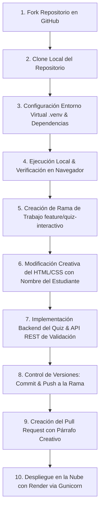

# 🚀 Proyecto Práctico: Stacks & Arquitecturas de Software

> **Materia:** Ingeniería de Software II  
> **Estudiante:** Andrés Felipe Escobar Patiño  
> **Repositorio Base:** [q3in-unilasallista/mi_proyecto_python](https://github.com/q3in-unilasallista/mi_proyecto_python.git)  

---

## 📌 Formato de Entrega y Evidencias Obligatorias

| Ítem | Descripción | Evidencia / Enlace |
| :--- | :--- | :--- |
| **1. Fork de GitHub** | Enlace del Fork con la modificación realizada | `https://github.com/aescobar16/P2_ParcialFeibert` |
| **2. Pull Request** | Enlace del PR hacia el repositorio original | *(Coloca aquí el enlace generado tras abrir el PR)* |
| **3. Despliegue en Render** | Enlace público de la aplicación en producción | *(Coloca aquí tu URL pública de Render: https://...onrender.com)* |
| **4. Ejecución local** | Evidencia de ejecución con `.venv` activo | `http://127.0.0.1:5000` (Ver sección de ejecución local) |
| **5. Despliegue en Render** | Evidencia de servicio activo en la nube | Servicio Web configurado con `gunicorn app:app` |

---

## 1. Fork del Repositorio
- Se realizó el Fork del repositorio original `q3in-unilasallista/mi_proyecto_python.git` hacia la cuenta personal de GitHub:
  - Repositorio Fork: `https://github.com/aescobar16/P2_ParcialFeibert`

---

## 2. Ejecución Local del Proyecto (Paso a Paso)

### A. Clonación del repositorio
```bash
git clone https://github.com/aescobar16/P2_ParcialFeibert.git
cd P2_ParcialFeibert
```

### B. Configuración del entorno virtual aislado (`.venv`)
```powershell
# Creación del entorno virtual
python -m venv .venv --copies

# Habilitar política de ejecución en PowerShell
Set-ExecutionPolicy -ExecutionPolicy RemoteSigned -Scope Process -Force

# Activación del entorno virtual
.\.venv\Scripts\Activate.ps1
```

### C. Instalación de dependencias
```powershell
pip install -r requirements.txt
```
*Dependencias instaladas: Flask (>=3.0.0), Gunicorn (>=21.2.0).*

### D. Ejecución y Visualización en el Navegador
```powershell
$env:FLASK_APP = "app.py"
flask run
```
- **Visualización en el navegador:** [http://127.0.0.1:5000](http://127.0.0.1:5000) (Código HTTP 200 OK).

---

## 3. Análisis de la Estructura y Arquitectura

### Arquitectura Identificada & Justificación:
* **Patrón de Arquitectura:** **Arquitectura por Capas / MVC Ligero (Model-View-Controller)** adaptado a microframeworks web.
* **Componentes del Sistema:**
  * **Controlador y Despachador de Rutas (`app.py`):** Gestiona los endpoints HTTP (`/` y `/api/quiz/validate`). Desacopla la lógica de verificación de respuestas recibiendo y respondiendo mediante JSON asíncrono.
  * **Capa de Presentación / Vistas (`templates/index.html`):** Plantilla enriquecida con Jinja2 y Vanilla CSS moderno (Glassmorphism, gradientes y animaciones). Emplea JavaScript nativo (`fetch API`) para no recargar la página.
  * **Modelo / Lógica de Negocio:** Banco estructurado de preguntas y lógica de validación pedagógica sobre estilos arquitectónicos.
* **Justificación:** Esta arquitectura modular ofrece alta cohesión y bajo acoplamiento. La separación del frontend y el API de validación garantiza que la aplicación sea liviana, fácil de mantener, testear y escalar horizontalmente sin sobrecarga computacional.

---

## 4. Implementación del Quiz Interactivo

Se incorporó una funcionalidad de Quiz interactivo sobre **Stack y Arquitecturas de Software** con las siguientes especificaciones:
- **Preguntas temáticas:**
  1. *Arquitectura Hexagonal (Puertos y Adaptadores)*: Aislamiento del núcleo de negocio de la infraestructura.
  2. *Rol de Gunicorn en el Stack Python/Flask*: Servidor WSGI para gestión de concurrencia y procesos worker en producción.
  3. *Microservicios vs Monolito*: Escalabilidad modular y despliegue desacoplado.
- **Mínimo cuatro opciones de respuesta:** Identificadas visualmente con letras A, B, C y D.
- **Identificación de la respuesta seleccionada:** Indicador en tiempo real con efecto visual diferenciado al hacer clic.
- **Retroalimentación para el estudiante:** Notificación detallada de éxito o error con justificación técnica.
- **Indicación visual:** Opciones coloreadas en verde (correcta) y rojo (errónea).
- **Presentación visual coherente:** Integrada armoniosamente en la interfaz temática con modo oscuro y tarjetas estilizadas.

---

## 5. Control de Versiones

El desarrollo se gestionó mediante una rama de trabajo independiente:
- **Rama creada:** `feature/quiz-interactivo`
```bash
git checkout -b feature/quiz-interactivo
git add .
git commit -m "feat: implementar seccion creativa de Andres Escobar, quiz interactivo de arquitectura y documentacion"
git push origin feature/quiz-interactivo
```

---

## 6. Creación del Pull Request

Se generó la solicitud de extracción (Pull Request) hacia el repositorio original `q3in-unilasallista/mi_proyecto_python.git`.

### Descripción del Pull Request (Párrafo Creativo Obligatorio):
> **Andrés Felipe Escobar Patiño** presenta una profunda renovación visual y arquitectónica del proyecto, elevando la interfaz HTML/CSS mediante una sofisticada estética *glassmorphism* con gradientes orgánicos, iluminación ambiental y micro-interacciones responsivas que proporcionan una experiencia de usuario moderna y profesional. Como aporte funcional y pedagógico, se diseñó e implementó un módulo interactivo de Quiz sobre Stack y Arquitecturas de Software (Hexagonal, WSGI con Gunicorn y Microservicios), el cual valida asíncronamente las respuestas del estudiante a través de un endpoint desacoplado en Flask, brindando retroalimentación técnica instantánea y dejando el sistema completamente optimizado para su despliegue continuo en la nube mediante Render.

---

## 7. Despliegue en la Nube (Render) y Pipeline del Trabajo

### Actividad 1 & 2: Registro, Configuración y Verificación
- Archivo `Procfile` configurado para producción:
  ```procfile
  web: gunicorn app:app
  ```
- Configuración en el panel de Render:
  - **Type:** Web Service
  - **Build Command:** `pip install -r requirements.txt`
  - **Start Command:** `gunicorn app:app`
  - **Environment:** Python 3

### Actividad 4: Pipeline del Trabajo Realizado
Flujo de trabajo desarrollado durante la práctica:



### Actividad 5: Reflexión Arquitectónica
> **¿De qué manera el stack tecnológico y la arquitectura seleccionados responden a la historia de usuario del proyecto?**  
> 
> El stack seleccionado (**Python + Flask + Gunicorn + Render**) junto a una arquitectura **MVC Ligera desacoplada** satisface integralmente la historia de usuario:
> 1. **Agilidad y Simplicidad:** Flask minimiza el boilerplate innecesario, permitiendo desarrollar e integrar rápidamente la sección creativa personalizada con el nombre de **Andrés Felipe Escobar Patiño** y el módulo del quiz interactivo.
> 2. **Rendimiento y Escalabilidad:** En entornos locales, el servidor de desarrollo de Flask facilita la depuración inmediata. En producción (Render), **Gunicorn** actúa como intermediario WSGI multiproceso, asegurando que múltiples estudiantes puedan responder simultáneamente el quiz sin degradación del servicio ni cuellos de botella.
> 3. **Desacoplamiento y Mantenibilidad:** La separación entre la capa de presentación (HTML/CSS interactivo) y el backend (ruta API REST) hace que la lógica de evaluación sea fácilmente extensible (por ejemplo, para agregar más preguntas o persistencia en bases de datos) sin alterar la experiencia visual del usuario.
