# 🚀 Plataforma Interactiva de Arquitectura & Stacks de Software

> **Ingeniería de Software II — Evaluación Práctica**  
> **Estudiante:** Feibert Alirio Guzmán Pérez  
> **Repositorio Base:** [q3in-unilasallista/mi_proyecto_python](https://github.com/q3in-unilasallista/mi_proyecto_python.git)  

---

## 📋 Resumen del Proyecto

Este proyecto adapta y extiende una aplicación web construida con **Python** y el microframework **Flask**, dotándola de una interfaz moderna y un **módulo interactivo de Quiz** sobre estilos arquitectónicos y stacks tecnológicos. Está diseñado para ejecutarse localmente mediante entornos virtuales aislados (`.venv`) y desplegarse como servicio web en la nube (**Render**) usando **Gunicorn** como servidor WSGI de producción.

---

## 🏛️ Análisis de Estructura y Arquitectura

### 1. Arquitectura Identificada & Justificación
* **Patrón de Arquitectura:** **Arquitectura por Capas / MVC Ligero (Model-View-Controller)** adaptado a microservicios monolíticos.
* **Componentes:**
  * **Controlador y Ruteo (`app.py`):** Expone los endpoints HTTP y orquesta la lógica del servidor, incluyendo la API RESTful `/api/quiz/validate` encargada de comprobar las respuestas de forma desacoplada.
  * **Capa de Presentación / Vistas (`templates/index.html`):** Utiliza Jinja2 para la renderización inicial del DOM, enriquecido con Vanilla CSS con diseño glassmorphism, micro-animaciones y JavaScript asíncrono (`fetch`) para una experiencia de usuario dinámica e inmediata.
  * **Lógica de Dominio y Modelo de Datos:** Banco estructurado de preguntas sobre arquitectura desacoplada (Hexagonal, Microservicios, WSGI), manteniendo la cohesión y separación de responsabilidades.
* **Justificación:** Este enfoque maximiza la simplicidad y el rendimiento al tiempo que preserva la modularidad. Al separar la validación del quiz vía API JSON, se facilita tanto el testing automatizado como una hipotética migración hacia un frontend desacoplado (React/Vue) o arquitectura orientada a servicios.

---

## 🧠 Módulo de Quiz Interactivo

El módulo interactivo evalúa conceptos vistos en clase:
1. **Arquitectura Hexagonal (Puertos y Adaptadores):** Aislamiento del núcleo de negocio de agentes externos.
2. **Rol de Gunicorn en el Stack Python/Flask:** Gestión concurrente de workers WSGI en producción.
3. **Microservicios vs Monolito:** Ventajas de escalabilidad modular y desacoplamiento de despliegues.

**Características del Quiz:**
- Cuatro opciones por pregunta identificadas con letras (A, B, C, D).
- Selección visual interactiva con resaltado en tiempo real.
- Validación asíncrona contra el backend (`/api/quiz/validate`).
- Retroalimentación explicativa inmediata (indicadores de acierto/error y justificación teórica).

---

## ⚙️ Guía de Ejecución Local

### Prerrequisitos
- Python 3.10 o superior instalado.
- Git.

### Paso 1: Clonar el Repositorio
```bash
git clone https://github.com/aescobar16/P2_ParcialFeibert.git
cd P2_ParcialFeibert
```

### Paso 2: Crear y Activar Entorno Virtual
```powershell
# En Windows (PowerShell)
python -m venv .venv --copies
Set-ExecutionPolicy -ExecutionPolicy RemoteSigned -Scope Process -Force
.\.venv\Scripts\Activate.ps1
```

### Paso 3: Instalar Dependencias
```powershell
pip install -r requirements.txt
```

### Paso 4: Ejecución Local de la Aplicación
```powershell
$env:FLASK_APP = "app.py"
flask run
```
Accede en tu navegador a: [http://127.0.0.1:5000](http://127.0.0.1:5000)

---

## 🚀 Despliegue en Render

El proyecto incluye un `Procfile` configurado para producción:
```procfile
web: gunicorn app:app
```

### Pasos para el Despliegue:
1. Conectar tu repositorio de GitHub en [Render Dashboard](https://dashboard.render.com).
2. Crear un nuevo **Web Service**.
3. Configurar:
   - **Environment:** `Python 3`
   - **Build Command:** `pip install -r requirements.txt`
   - **Start Command:** `gunicorn app:app`

---

## 🔄 Pipeline del Flujo de Trabajo

El siguiente esquema representa las etapas desarrolladas durante la práctica:

```mermaid
flowchart LR
    A[1. Fork Repositorio] --> B[2. Clone Local]
    B --> C[3. Config .venv & Pip]
    C --> D[4. Ejecución Local Flask]
    D --> E[5. Rama Git feature/quiz-interactivo]
    E --> F[6. Modificación Creativa HTML/CSS]
    F --> G[7. Implementación Backend Quiz]
    G --> H[8. Commit & Push]
    H --> I[9. Pull Request a Repo Base]
    I --> J[10. Despliegue Cloud en Render]
```



---

## 💡 Reflexión Arquitectónica

> **¿De qué manera el stack tecnológico y la arquitectura seleccionados responden a la historia de usuario?**  
> 
> La combinación de **Python + Flask + Gunicorn + Render** responde de manera óptima a la necesidad planteada en la historia de usuario de proveer una plataforma ágil, educativa y accesible en la nube. **Flask**, por su naturaleza de microframework minimalista, elimina sobrecargas innecesarias y reduce el *Time-to-Market*, permitiendo implementar y validar rápidamente el componente interactivo de evaluación. La adopción de un servidor WSGI como **Gunicorn** cubre el requisito no funcional de concurrencia y estabilidad operativa ante múltiples estudiantes interactuando simultáneamente con el quiz. Finalmente, la integración continua y el despliegue administrado en **Render** abstraen la administración de servidores, asegurando disponibilidad inmediata a través de una URL pública con HTTPS nativo.
